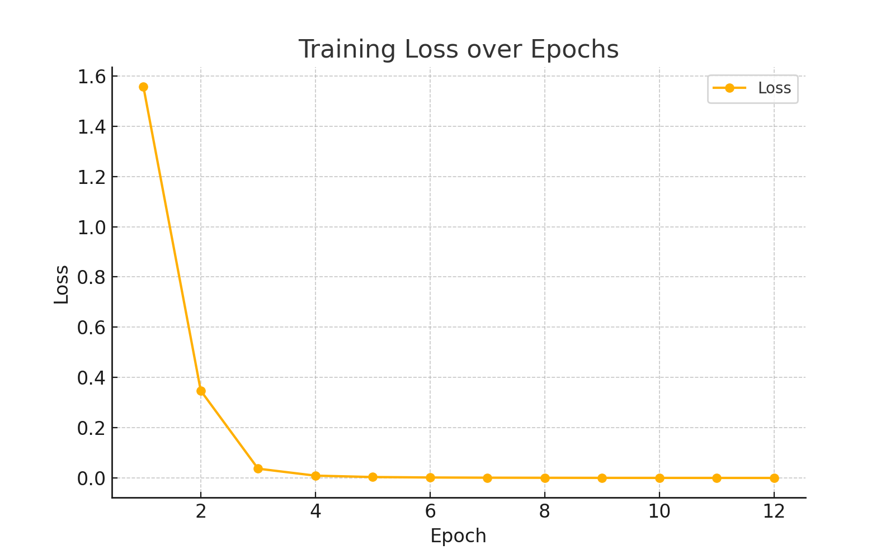
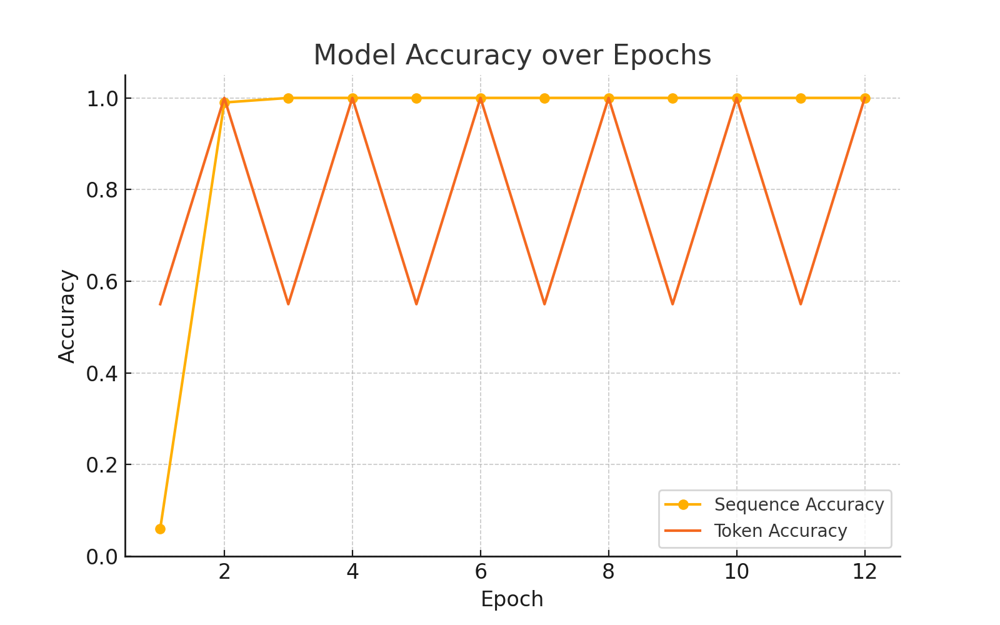

# 🧠 Comparison of CNN Architectures on Different Datasets


This project compares several CNN models across popular computer vision datasets with Colab GPU acceleration.

## ✅ CNN Architectures Evaluated
- AlexNet
- VGG16
- GoogLeNet
- ResNet18
- Xception
- SENet

## 📦 Datasets Used
- MNIST
- Fashion-MNIST (FMNIST)
- CIFAR-10

## ⚡ Optimizations Included
- ✅ Subset sampling (30% of training data) to speed up training
- ✅ Mixed precision training (AMP) using `torch.cuda.amp`
- ✅ PyTorch 2.0 `torch.compile()` for faster execution
- ✅ Google Colab GPU compatible (NVIDIA T4 recommended)

## 📌 Instructions for Use
1. Upload `CNN_Project.ipynb` to [Google Colab](https://colab.research.google.com/)
2. Set Runtime > Change Runtime Type > Hardware Accelerator > **GPU**
3. Run all cells from top to bottom
4. Visualizations and metrics (accuracy, F1, confusion matrix) will be printed per model per dataset

## 🛠️ Requirements (auto-installed)
- `torch`, `torchvision`, `timm`, `matplotlib`, `seaborn`, `scikit-learn`

## 🧾 Output
- Confusion matrices
- Accuracy, precision, recall, F1-score
- Trained results on 3 datasets × 6 models

---

> Built for efficiency and benchmarking in computer vision model selection.


# 🤖 MultiFunctional_NLP_ImageGeneration

An interactive, multi-functional MultiMind Streamlit app that brings together the power of Hugging Face models for a variety of NLP and image generation tasks. This project is designed to run locally in VS Code!

---

## 🚀 Features

- 📝 **Text Summarization**
- 🔮 **Next Word Prediction**
- 📚 **Story Prediction / Continuation**
- 💬 **Chatbot Response Generation**
- 😊 **Sentiment Analysis**
- ❓ **Question Answering**
- 🎨 **Image Generation** (via Stable Diffusion)
- 📥 Output Download Support (.txt, .png)
- 🧹 In-App Cache Clearing for Memory Management

---

## 🧑‍💻 How to Use Locally (VS Code)

### 1. Clone the Repository
### 2. Install Dependencies
### 3. Run the App


streamlit run Multimind_App.py


---

## 📌 Notes

- You can Use a **GPU** runtime in Colab for image generation.
- You can upload `.txt` files and download generated content.
- The app is optimized with lazy model loading and caching.
- Models used include `facebook/bart-large-cnn`, `gpt2`, `EleutherAI/gpt-neo`, `microsoft/DialoGPT`, `CompVis/stable-diffusion-v1-4`, and more.

---

# Sequence-2-Sequence Project:

This project implements a Sequence-to-Sequence (Seq2Seq) model using GRU with an Attention mechanism to learn how to reverse a sequence of digits.

---

## 🧠 Objective
Train a model that takes a sequence like `[4, 5, 6, 7, 8, 9]` and predicts its reverse `[9, 8, 7, 6, 5, 4]` using attention-based encoder-decoder architecture.

---

## 🧱 Architecture
- **Encoder:** GRU-based recurrent network to process input.
- **Attention:** Allows decoder to focus on relevant encoder states.
- **Decoder:** GRU-based decoder that uses attention context.
- **Loss Function:** CrossEntropyLoss.
- **Optimizer:** Adam.

---

## 📊 Results

### Loss Curve


### Accuracy Curve


- Sequence Accuracy: Improved from 0.06 to 1.00 in 2 epochs.
- Token Accuracy: Achieved 1.00 by epoch 1 and sustained through epoch 12.

---

## 📌 Key Concepts
- **<sos> Token Alignment:** Start-of-sequence token enables the decoder to start generating the output.
- **Teacher Forcing:** During training, decoder receives the true previous token, stabilizing learning.

---

## 🧪 Sample Predictions
```
Input     : [4, 5, 8, 6, 3, 6]
Target    : [6, 3, 6, 8, 5, 4]
Predicted : [6, 3, 6, 8, 5, 4]
✔️ Match!

Input     : [5, 6, 8, 8, 7, 6]
Target    : [6, 7, 8, 8, 6, 5]
Predicted : [6, 7, 8, 8, 6, 5]
✔️ Match!
```

---

## 🎯 Applications
- Educational NLP demos
- Language model testing
- Precursor for real-world tasks like translation or summarization

---

## 🧾 Files
- `Seq2Seq_.ipynb` - Core model code
- `loss_curve.png` - Training loss plot
- `accuracy_curve.png` - Accuracy plot

## 📬 Contact

Built with ❤️ by Prachi.  
For suggestions or issues, please raise an [issue](https://github.com/PrachiCh2611/Final_Project.git).
